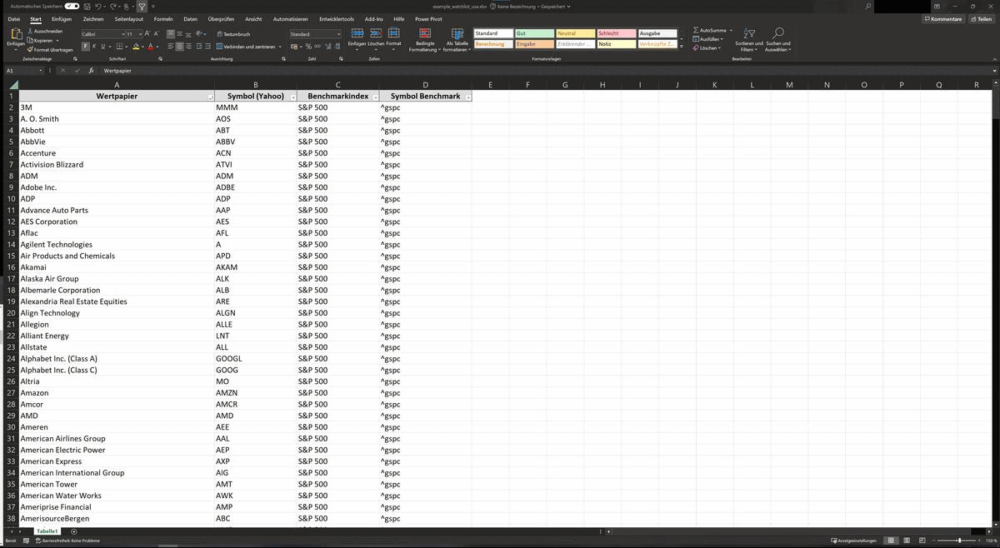

Levermann tool - quantitative stock analysis
==============================

This little python script for quantitative stock analysis uses the valuation method developed by [Susann Levermann](https://de.wikipedia.org/wiki/Susan_Levermann). Some changes to the original strategy were made, following the approach of Petra Wolff, which is also described [on her blog](https://petrawolff.blog/levermann-experiment/).
The data for the financials is fetched from Yahoo Finance, mainly using the python modules `yahooquery` and `yfinance`.

- A manual on how to use the tool can be found in references -> [getting started](docs/getting-started.rst)
- Need some background on the strategy? Check the document on the [Strategy](references/Strategy)

Disclaimer: this tool is for information purposes only. It is not intended to be used for making investment decisions!
