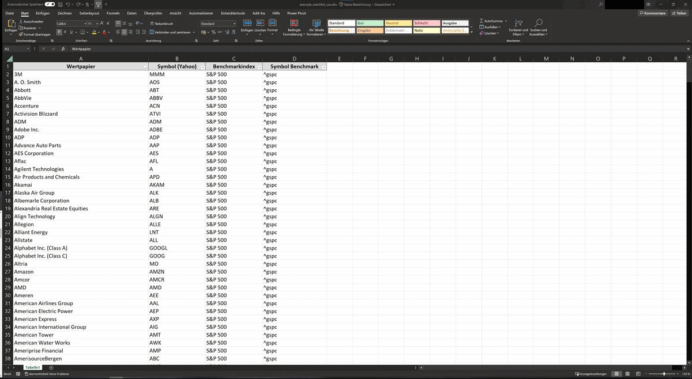

Levermann tool - quantitative stock analysis
==============================

This little python script can be used to automate your stock analysis process. It's a quantitative approach based on the valuation methodology developed by German funds manager [Susann Levermann](https://de.wikipedia.org/wiki/Susan_Levermann). Some changes to the original strategy (i.e. omitting differenciation in awarding points based on the market cap of the stock) were made, following the approach of Petra Wolff, which is also described [on her blog](https://petrawolff.blog/levermann-experiment/).
The data for the financials is fetched from Yahoo Finance, mainly using the python modules `yahooquery` and `yfinance`.

- Jupyter notebook is located [here](notebooks/1.0-levermann-analysis.ipynb)
- A manual on how to use the tool can be found in references -> [getting started](docs/getting-started.md)
- An interpretation guide can be found in this [analysis of the results](reports/analysis.md)
- Sample output can be found in this excel file under [reports](reports/Results_as of_2023-08-28.xlsx) as well as [result plots](reports/figures)
- Need some background on the strategy? A brief overview can be found in [Strategy](docs/strategy.md) (or check the above mentioned links)

Running the notebook generates an Excel-file with a summary of the total scores as well as separate sheets for metrics. The result plots shown here will also be created.

Disclaimer: this tool is for information purposes only. It is not intended to be used for actual trading or making investment decisions!
