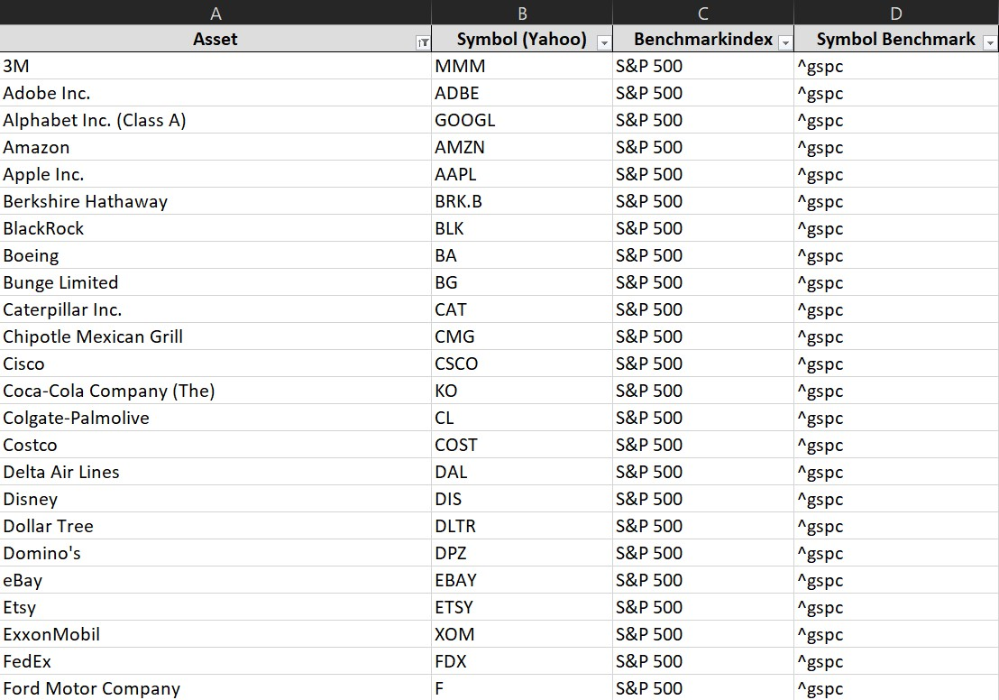

# Levermann Tool User Manual
This manual aims to assist you in conducting your own analyses using the provided script.

#  Prerequisites
Python
The required package list is available in the [requirements.txt](./requirements.txt) file.

Input Data
The script reads data from an Excel file that must have 4 columns essential for the analysis:


- Asset name
- Yahoo! Finance Ticker Symbol
- Corresponding customizable Benchmark index
- Yahoo! Finance Ticker Symbol of the Benchmark
You can find a sample Excel file pre-filled with S&P 500 stocks, as well as a pre-filled version with German stocks covering DAX, MDAX, SDAX, TecDAX.

## Defining Parameters
Adjust the script to your preferences using the variables in the second cell of the Jupyter notebook.
```
# Wartezeit zwischen einzelnen Anfragen an den Yahoo! Server (Erhöhung kann ggfs. zur Reduzierung von Fehlern beitragen)
seconds_sleep = 0.0

# Benchmarkindex für die Liniendiagramme festlegen
# Yahoo Ticker Symbol verwenden, z.B: ^gdaxi für DAX, ^gspc für S&P 500 usw.
benchmark_index = {"^gspc": "S&P 500"}

# Definiere Styles für die Matplotlib-Plots
list_styles = ["fivethirtyeight",
               "seaborn-v0_8-white"
               ]
```
- seconds_sleep: Time between requests to Yahoo! servers. Increasing this might reduce errors.
- benchmark_index: Dictionary for resulting line plots. Stock valuation still requires a benchmark index in the input Excel file.
- list_styles: Specify one or more Matplotlib styles for plotting. Styles should be locally available or accessible online.

## Running the Script
Starting the script presents a GUI prompt to select the input data Excel file. The output files are created in the same directory with a timestamp prefix. 
Output includes an Excel file with analysis results. It contains a summary sheet, total score, PE ratio, and recommended max stock price. Additional rows use predicted earnings for current year to set a price limit.
The Excel file has sheets for calculation details of each of the 13 criteria. For criterion overview, refer to the [strategy document](./strategy.md).


Depending on defined Matplotlib styles, sets of result plots in PNG format may be generated. 
One set includes a summary graphic and 4 other detail plots:
- Summary containing below listed 4 plots.
- Bar chart ranking stocks from highest to lowest scores.
- Scatter plot showing correlation between 6-month share performance and total score.
- Line plot of share price development over 6 months with benchmark index comparison.
- Histogram of achieved scores for stock distribution.


## Troubleshooting
The script uses `yahooquery` and `yfinance`, which lack official Yahoo! Finance API support. Changes to Yahoo!'s website might break Python queries. Try updating modules with `pip install --upgrade` or check the module's repo ([yahooquery](https://github.com/dpguthrie/yahooquery) and [yfinance](https://github.com/ranaroussi/yfinance)).
Yahoo! servers could restrict access due to excessive requests. To avoid this, customize `seconds_sleep = 0` (default is zero). Adjust the 1.3-second wait time if necessary.

If you run into problems or have further questions, feel free to contact me on GitHub @duerrhannes!
