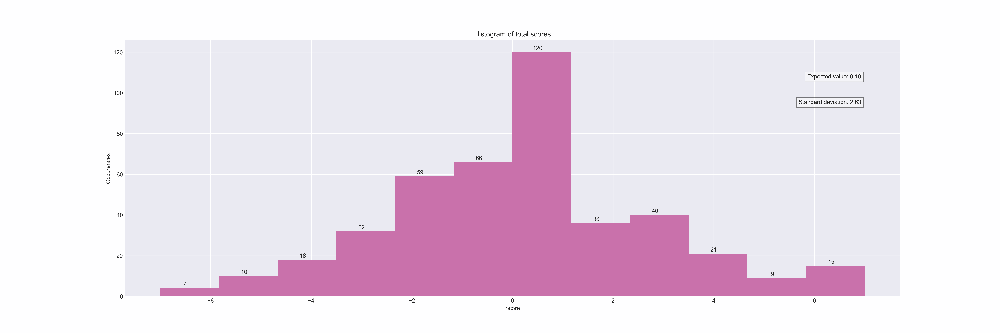
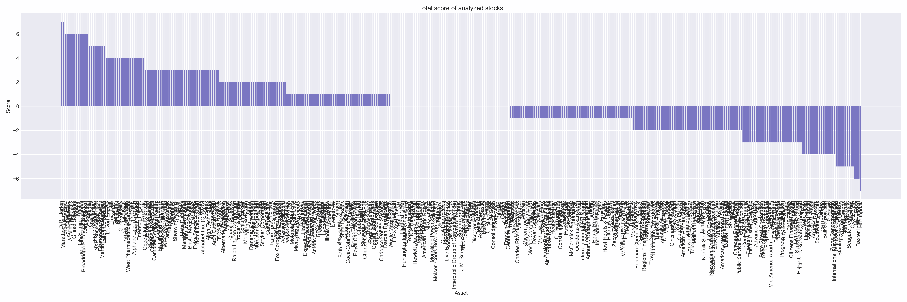
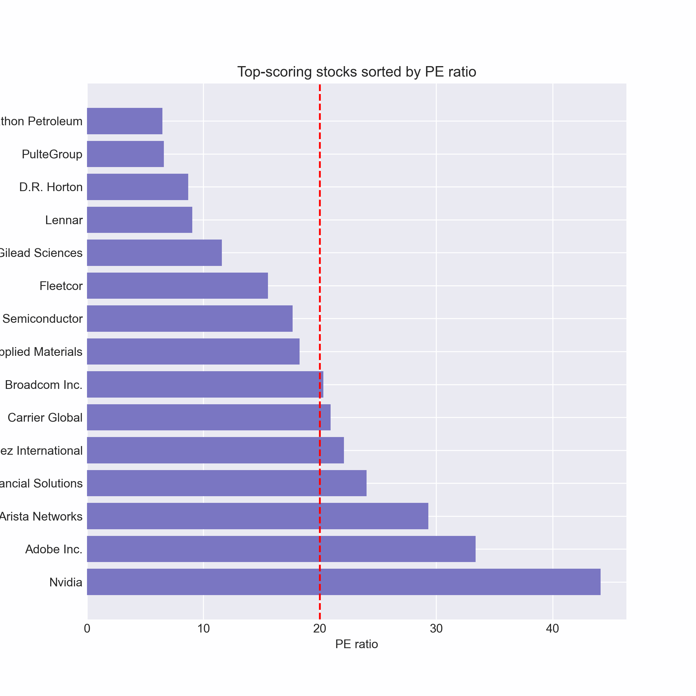
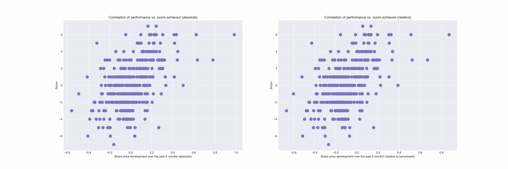

# This document provides an overview and sample interpretation of project results

N.B: The output plots are automatically generated when running the script using 'matplotlib' and can be customized with matplotlib styles. 

## Data collection

The dataset comprises financial data of S&P 500 stocks (for the list of companies, see: [Wikipedia](https://en.wikipedia.org/wiki/List_of_S%26P_500_companies)) with closing prices as of August 25, 2023. The data was collected from Yahoo Finance as probably the best-accessible source for free financial markets data. 
430 stocks out of the S&P 500 have complete data. In total, if stocks with one or more missing data entries are also taken into account, about 99% of all entries was successfully scraped.

## Total scores

Some stocks scored +6 or +7, with some stocks also having negative points in the same magintude. Determining a good score depends on various factors.
Some stocks achieved a total score of 6 or 7, but there were also stocks with the same amount of negative points. Based on a set of 13 criteria, is +6 oder +7 a good score? And at which level should you set your bar for buying/selling? That question's a difficult one to answer, as it depends on various factors. 
Let's have a look at the distribution of all values, first:

What observations can we make from above displayed histogram?
1. Most of the stocks seem to oscillate around 0 points (+/-).
2. Apparently, there is a *slightly* skewed distribution towards positive values.
3. The positive end of the distribution shows a kurtosis (so called "fat tails").

Based on the histogram, it seems reasonable a "buy" signal could be set around +5 or +6 points, and a "sell" threshold at +3.

## Potential candidates

But then, which stocks would be potential buy-candidates?
Let's rank all stocks by points:

That's a pretty crowded chart. If we filter only the stocks with +6 or +7 points, that's still 24 stocks left. As a criterion to order the group of the top-scoring stocks, we could take into account how expensive a share is. After all, it's a no-brainer that buying stocks a price too high is one of the most important performance-killers. Ranking the stocks primarily by points achieved and secondarily by the price-earnings ratio (PE ratio), results in this table:

## How did the stocks perform?

Having identified potential buy-candidates, you might ask yourself wheter you'd expect any significant outperformance of these stocks. After all, why bother to go through all this work, if you'd be better of in simply buying you SPY etf?
When we go back to the first figure and have a closer look on the line plot (bottom left), you can notice the 5 stocks with the highest scores (solid lines) outperformed the S&P 500 benchmark index, whereas the 5 stocks with the lowest scores (dashed lines) clearly underperformed. 

At a first glance, this seems quite impressive. But I have to pour some cold water on the matter. This correlation doesn't hold when considering all stocks over the past 6 months. The correlation coefficient is around 0.52, indicating a loose relationship.

The left scatterplot shows the share price development over the last 6 months (more precise: last closing price minus 180 days). The right figure renders the *relative* performance, meaning the performance of our benchmark index -which is the S&P 500-  is also taken into account. For example, on the left figure is at -2 points (total score) and 0.2 (equals +20%) share price development in the last 6 months. However, when we compare the performance of this stock to the S&P 500 benchmark index, which gained around +10% in the same period, the data point "shifts to the left", as you can see on the second figure: the data point is at around 0.1, which equals to +10% outperformance to the benchmark index. 

The correlation coefficient between these two metrics is about 0.52, meaning they are somewhat, but loosely correlated. If there was a strong relationship between the total score and the performance in the past few months, the points in the scatterplot would align more on a stright line. However, this is not the case.

## Summary tl;dr

Key takeaways are:
- Data from S&P 500 stocks collected, 430 complete datasets.
- Reasonable rules for identifying stocks to buy are a score of at least +6 points and an PE of 20 or lower. Sell treshold is set at +3. Of course this can be adjusted to your like.
- 24 potential high-scoring stocks, ranked by points and PE ratio. Filtered by PE ratio, 8 stocks remain.
- Top scorers outperformed S&P 500, but correlation is loose (correlation coefficient ~ 0.52).

## Final thoughts
Of course, it is not possible to predict future price movements based on historical performance, but after all, it is probably still a good base for decision-making.

Disclaimer: The above mentioned 
